# MyZIO

My ZIO

## ZIO

ZIO is a zero-dependency library for asynchronous and concurrent programming in Scala. It is a functional effect system in Scala.

There are several functional effect systems in functional programming in the Scala community, such as ZIO, Cats Effect, and Monix.

## Functional Effect

The functional effect is about turning the computation into first-class values. Every effect can be thought of as an operation itself, but a functional effect is a description of that operation.

For example, in Scala, the code `println(“Hello, Scala!”)` is an effect that prints the “Hello, Scala!” message to the console. The println function is of type Any => Unit. It returns Unit, so it is a statement.

But in ZIO, `Console.printLine(“Hello, ZIO!”)` is a functional effect of printing “Hello, ZIO!” on the console. It is a description of such an operation. Console.printLine is a function of type Any => ZIO[Any, IOException, Unit]. It returns the ZIO data type, which is the description of printing the message to the console.

So, in a nutshell:

An effect is about doing something, such as println(“Hello, Scala!”)

A functional effect is about the description of doing something, as in zio.Console.printLine(“Hello, ZIO!”)

## sbt ZIO

build.sbt

zio 2.x

```
libraryDependencies += "dev.zio" %% "zio" % "2.0.0-M4"
libraryDependencies += "dev.zio" %% "zio-streams" % "2.0.0-M4"
```

zio 1.x

```
libraryDependencies += "dev.zio" %% "zio" % "1.0.13"
libraryDependencies += "dev.zio" %% "zio-streams" % "1.0.13"
```

```
lazy val zioVersion = "1.0.13"

libraryDependencies ++= Seq(
  "dev.zio"                %% "zio"                     % zioVersion,
  "dev.zio"                %% "zio-streams"             % zioVersion,
  "org.scala-lang.modules" %% "scala-collection-compat" % "2.5.0",
  "dev.zio"                %% "zio-nio"                 % "2.0.0-RC2",
  "dev.zio"                %% "zio-test"                % zioVersion % Test,
  "dev.zio"                %% "zio-test-sbt"            % zioVersion % Test
)
```

```
libraryDependencies ++= Seq(
  "dev.zio" %% "zio" % "1.0.0-RC17",
  "dev.zio" %% "zio-streams" % "1.0.0-RC17",
  "com.propensive" %% "magnolia" % "0.12.6"
)
```

## STM (Software Transactional Memory)

## Misc

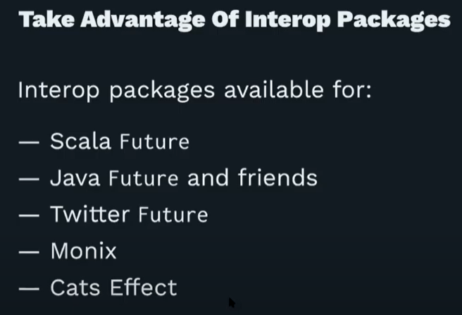

## 2022-02-26

- ZIO NIO

  A small, unopinionated ZIO interface to NIO

- Production log processing pipeline withq ZIO Streams

log file

```
Id_1 2017–10–28 00:04:43 INFO c.m.CamelApp: Running with Spring Boot
Id_3 2017–10–28 00:04:43 WARN c.m.CamelApp: No active profile set, falling back to default profiles: default
Id_4 2017–10–28 00:04:56 INFO c.m.amelBean: Process Data File: C:\data\full\Residential_201709301056.txt
Id_5 2017–10–28 00:06:37 ERROR c.m.s.RepoServiceImpl: null: 1048 Portage Rd
Id_6 2017–10–28 00:06:37 WARN c.m.s.RepoServiceImpl: Total properties in file: 25338, New: 25337, Existing: 0
Id_7 2017–10–28 00:34:34 INFO c.m.s.RepoServiceImpl: Active input: 25344
Id_8 2017–10–28 00:35:54 DEBUG c.m.s.RepoServiceImpl: Done parsing file: 871.xml
```

code

```
import java.nio.file.{Files, Paths}

import zio._
import zio.console._
import zio.duration._
import zio.stream._

object LogStreamApp extends App {

  def isErrorWarning(data: String) = {
    data.contains("ERROR") || data.contains("WARN")
  }

  def isError(data: String): Boolean = {
    data.contains("ERROR")
  }

  def processError(data: String) = {
    putStrLn(s"process error message: ${data}") *>
      Task.succeed()
  }

  def processWarning(list: List[String]) = {
    putStrLn(s"process warning messages in batch: ${list.length} => $list") *>
      Task.succeed()
  }

  def run(args: List[String]): ZIO[ZEnv, Nothing, Int] = {
    //val is = Files.newInputStream(Paths.get(ClassLoader.getSystemResource("prod_log.txt").toURI()))
    val is = Files.newInputStream(Paths.get("C:/temp/data/prod_log.txt"))

    val theJob = (for {
      streams <- ZStream
        .fromInputStream(is)
        .chunks
        .aggregate(ZSink.utf8DecodeChunk)
        .aggregate(ZSink.splitLines)
        .mapConcatChunk(identity)
        .tap(data => putStrLn(s"> $data"))
        .filter(isErrorWarning)
        .partition(isError, 4)
    } yield streams).use {
      case (leftStream, rightStream) => {
        val errorStream = leftStream
          .mapM(processError(_))
          .schedule(Schedule.fixed(2.second))

        val warningStream = rightStream
          .aggregate(ZSink.collectAllN[String](10))
          .mapM(processWarning(_))

        errorStream.merge(warningStream).runCollect
      }
    }

    theJob.fold(_ => 1, _ => 0)
  }
}
```

build.sbt

```
ThisBuild / scalaVersion := "2.13.6"

libraryDependencies ++= Seq(
  "dev.zio" %% "zio" % "1.0.0-RC17",
  "dev.zio" %% "zio-streams" % "1.0.0-RC17",
  "com.propensive" %% "magnolia" % "0.12.6"
)
```

## 2022-02-27

...

- ZIO stream

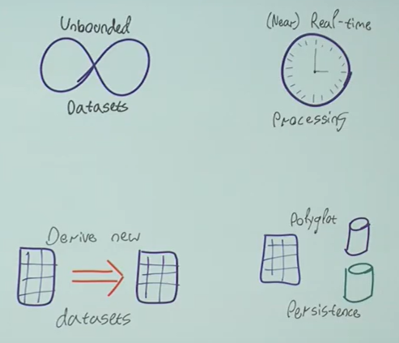

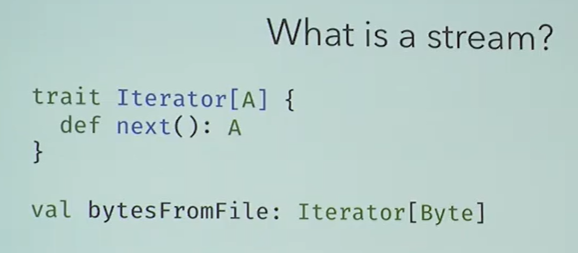

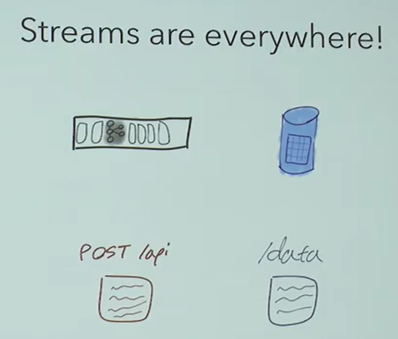

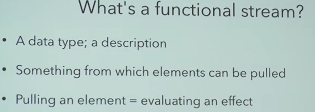

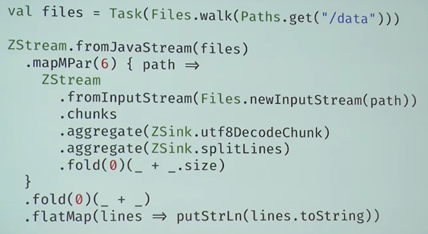

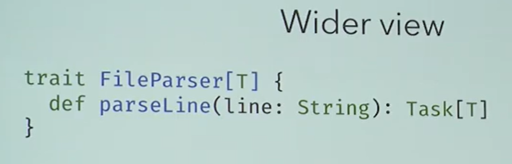

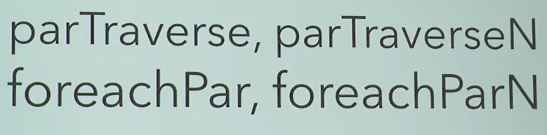

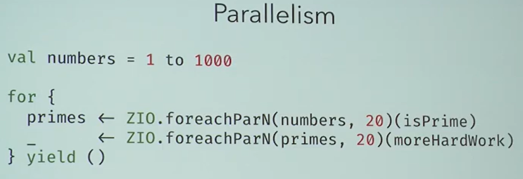

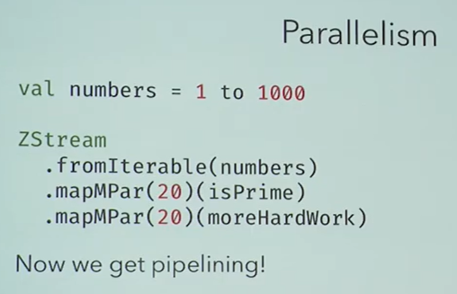

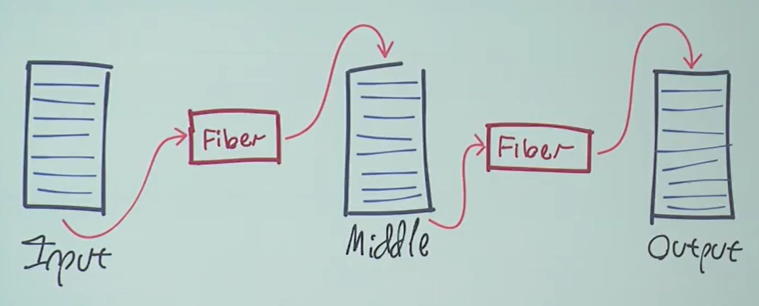

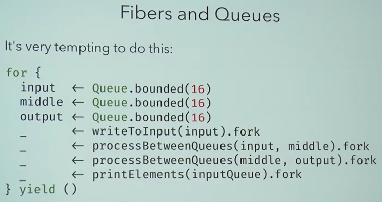

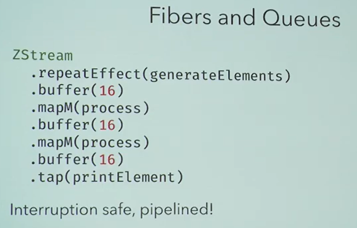

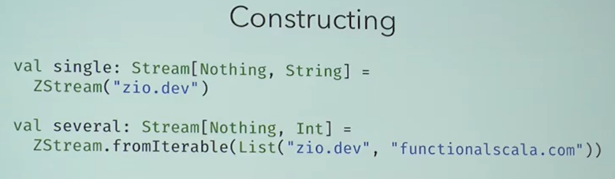

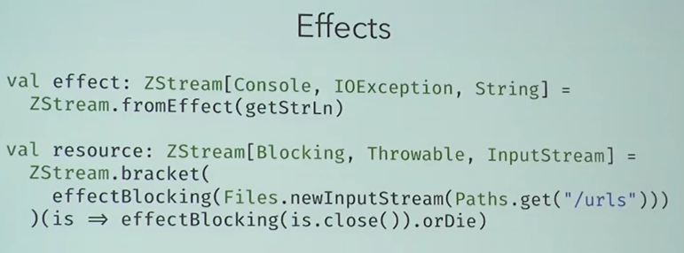

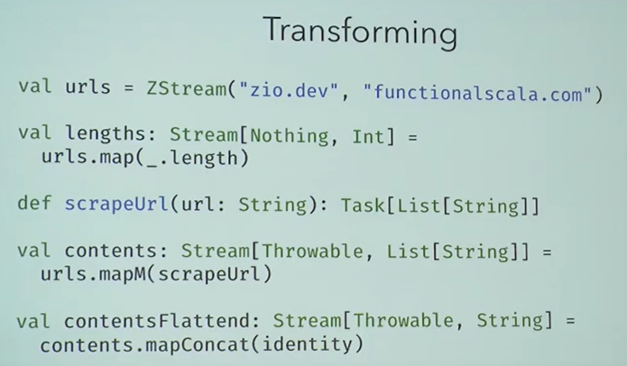

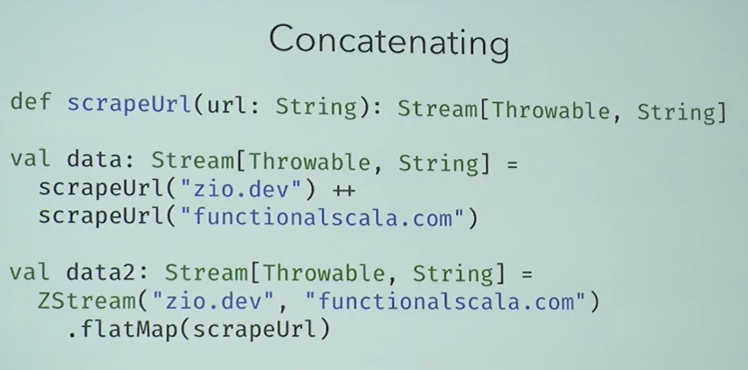

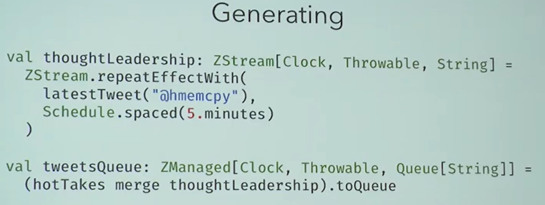

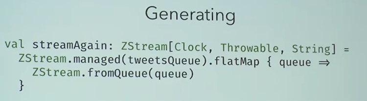

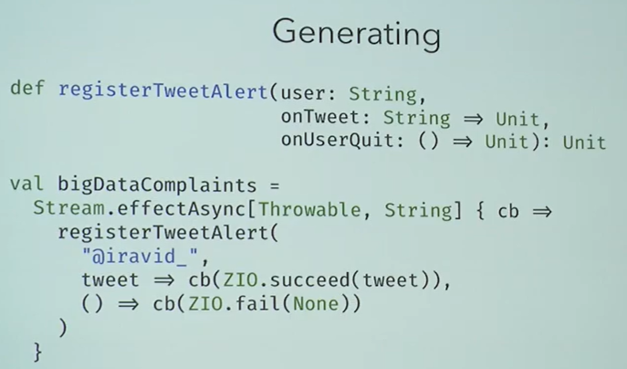

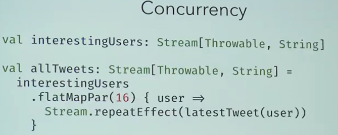

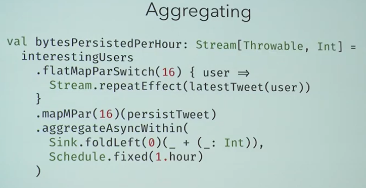

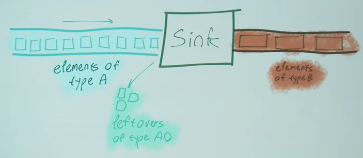

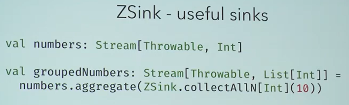

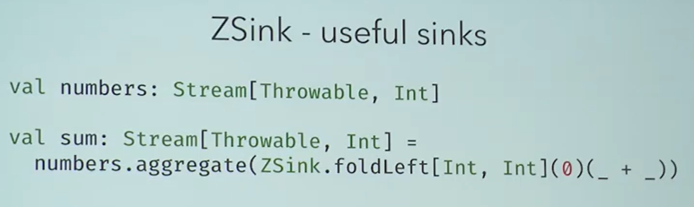

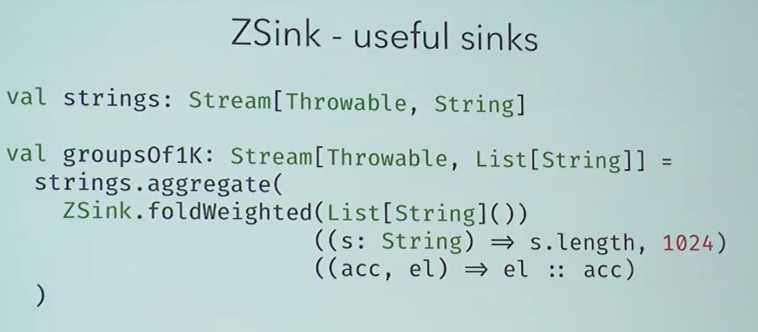

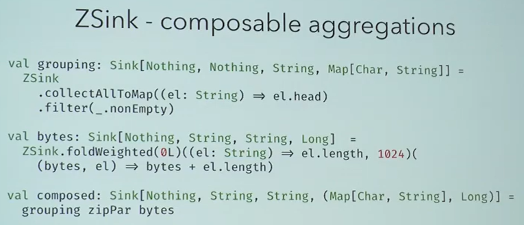

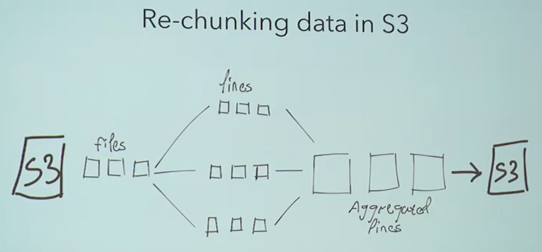

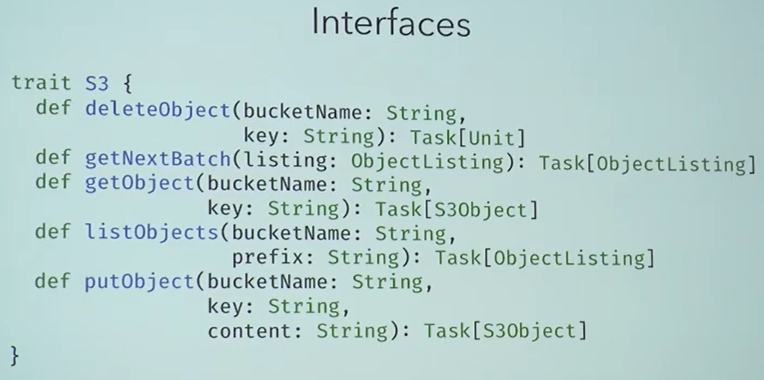

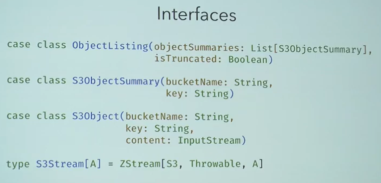

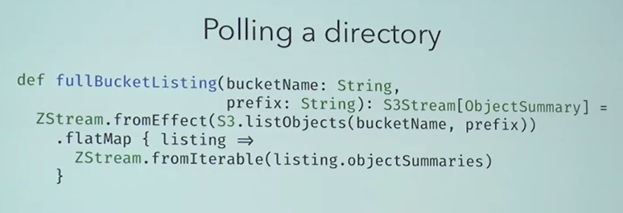

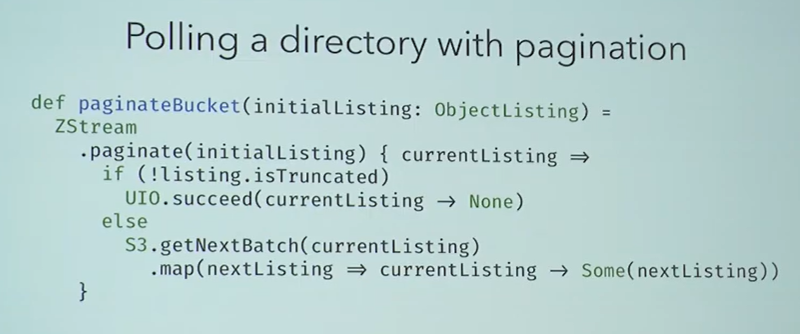

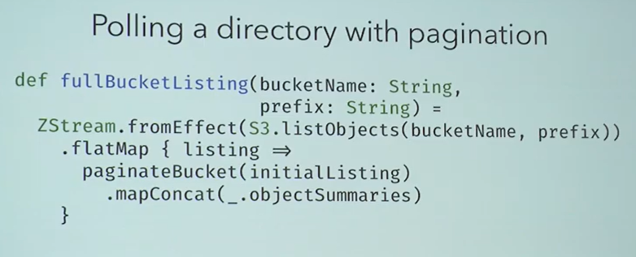

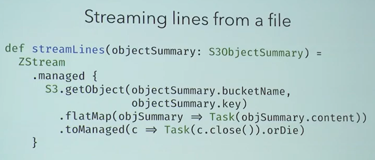

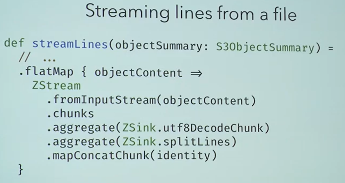

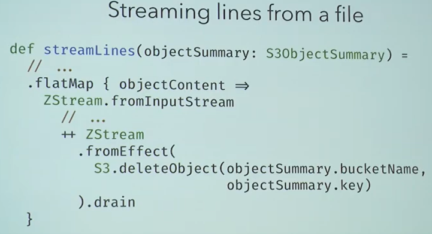

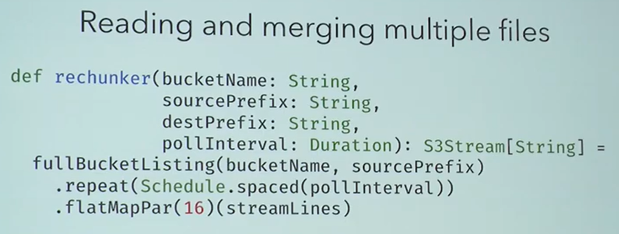

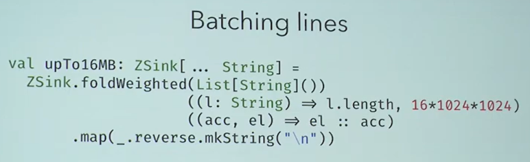

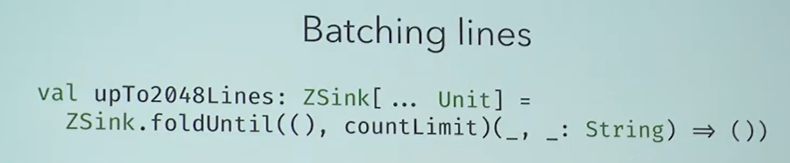

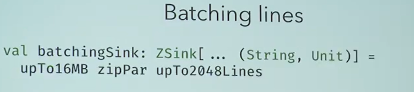

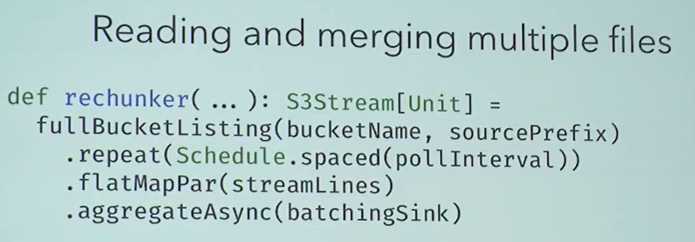

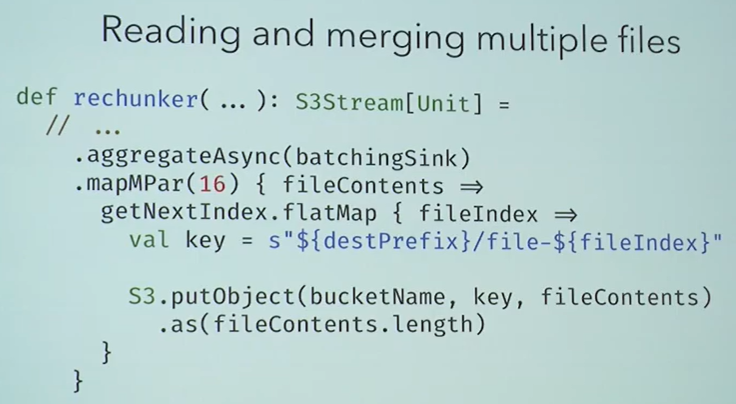

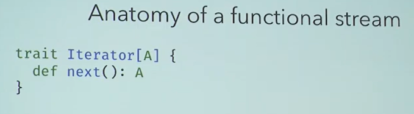

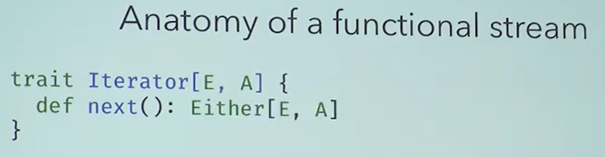

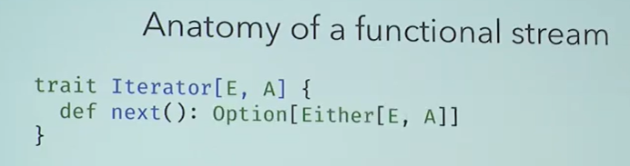

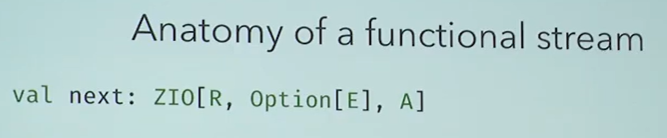

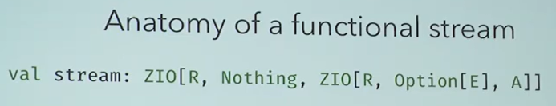

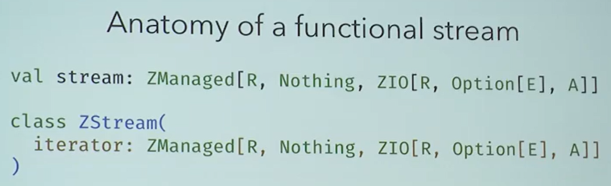
